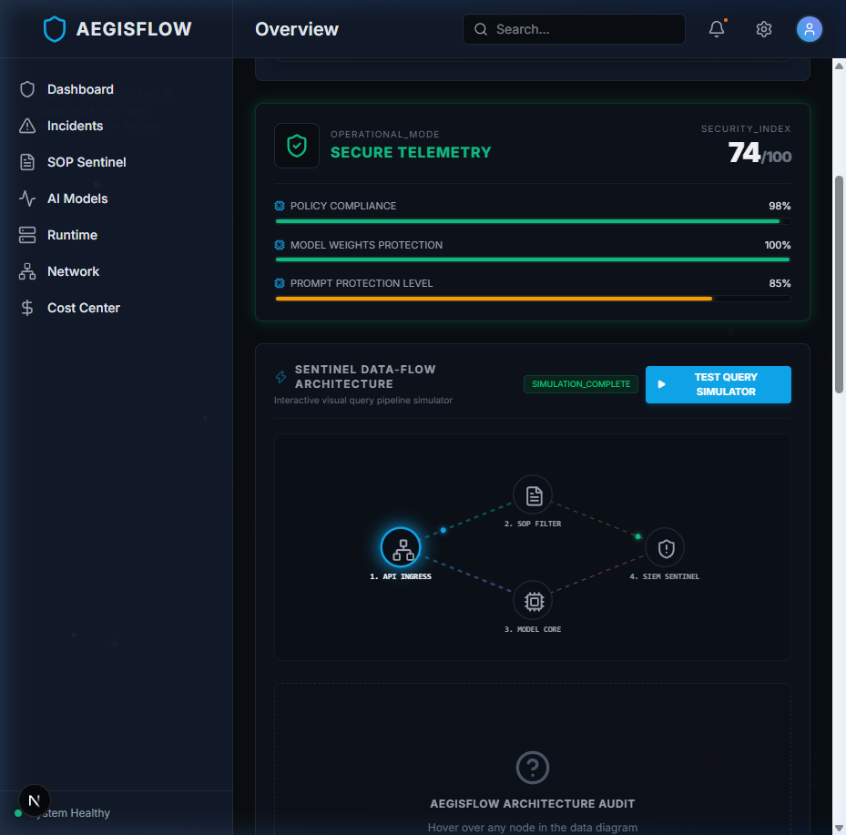
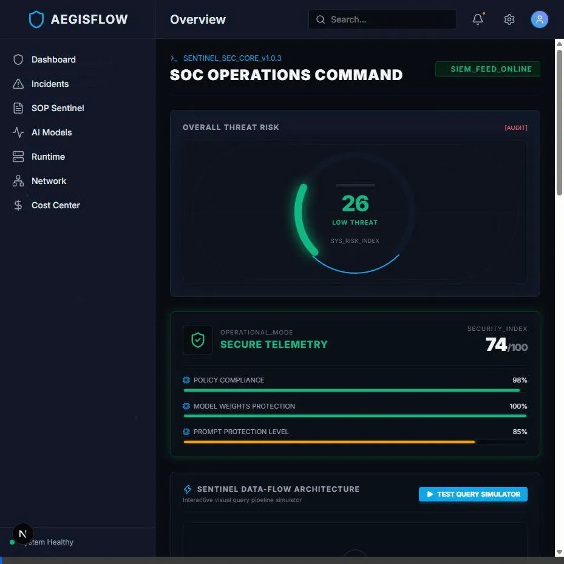
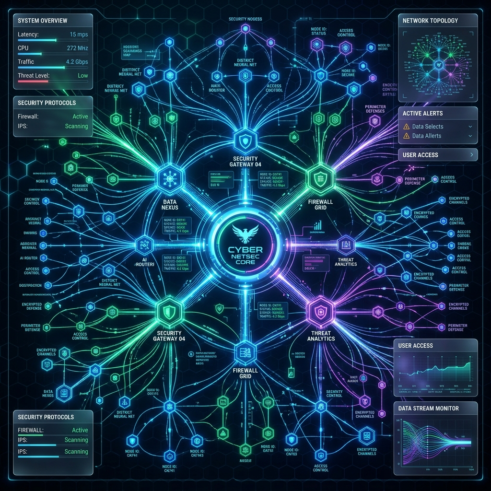
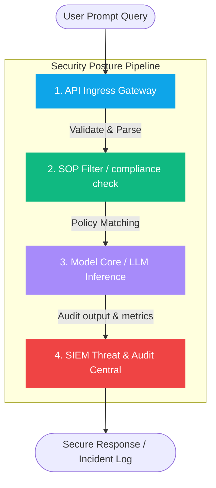

# AegisFlow Sentinel

AegisFlow Sentinel is a state-of-the-art AI Security Posture & SOP Monitoring Platform. It provides a real-time command center (SOC) for monitoring LLM/ML application risks, compliance audits, threat logs, and billing costs.

---

## 🌐 Cyber-Vibes Command Dashboard
Sentinel includes a full-screen dynamic **Kaspersky-inspired Threat Map Watermark** detailing simulated global threat vectors and live server ping sweeps, maintaining top-tier cyber security aesthetics.

### 📊 Live Dashboard Interface


---

## 🏗️ System Architecture

AegisFlow Sentinel processes all prompts, models, and alerts through a secure, multi-stage pipeline designed for safety, speed, and auditability.

### 🎬 Pipeline Walkthrough (Motion Graphics)


### 🔮 Security Core Advanced Architecture Concept





### 🔍 Detailed Pipeline Breakdown

#### 1. API Ingress Gateway
- **What it does**: The entry gate for all user queries and JSON payloads.
- **Under the hood**: Validates schemas, enforces rate limits, tokenizes query strings, and performs initial input scrubbing.

#### 2. Standard Operating Procedure (SOP) Auditor
- **What it does**: The compliance guard. It verifies user instructions against corporate policies.
- **Under the hood**: Uses semantic vector database searches against parsed PDF policy manuals to catch unauthorized instructions and prompt injection attempts before they reach the model.

#### 3. Model Inference Core
- **What it does**: The AI brain that generates the output.
- **Under the hood**: Executes inference workflows on approved prompts, loading weights via Triton or Hugging Face. Tracks attention layers to prevent toxic alignment drifts.

#### 4. SIEM Threat & Audit Central
- **What it does**: The security logs and billing ledger.
- **Under the hood**: Scans generated outputs for PII leaks, records API latency, logs Hugging Face safety evaluations, and computes exact token cost logs.

---

## 🛠️ Tech Stack

- **Frontend**: Next.js 16.3 (Turbopack), React 19, Tailwind CSS v4, Framer Motion, Lucide Icons, Recharts.
- **Backend**: FastAPI, Uvicorn, SQLite, SQLAlchemy, PyMuPDF.

---

## 🚀 Getting Started

### 1. Start the Backend API Server
Navigate to the `backend` folder and start the Uvicorn server:
```bash
python -m uvicorn backend.main:app --host 127.0.0.1 --port 8000
```

### 2. Start the Frontend Dev Server
In the root directory, install dependencies and launch Next.js:
```bash
npm install
npm run dev
```

Open **[http://localhost:3000](http://localhost:3000)** in your browser.
